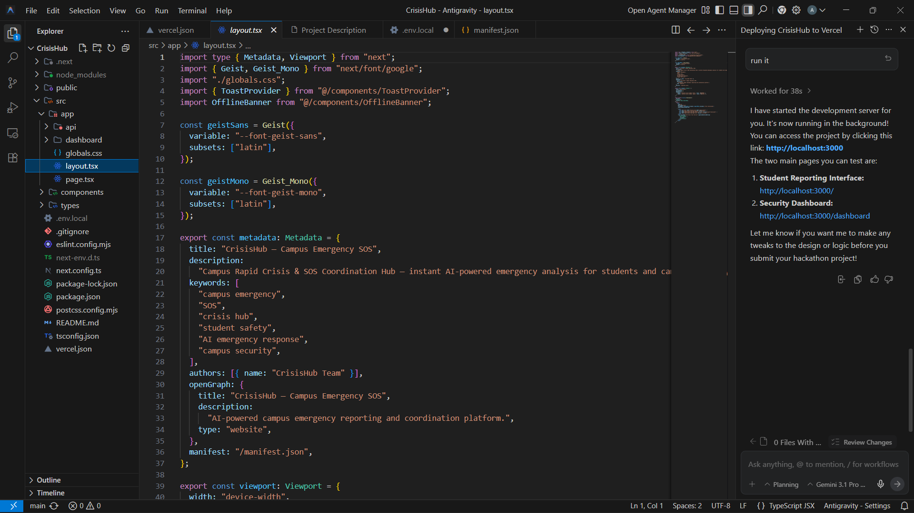
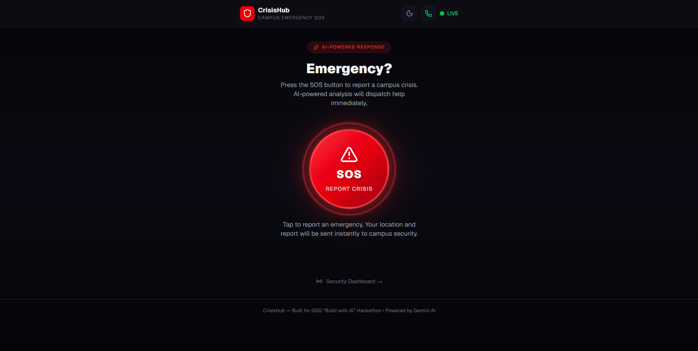
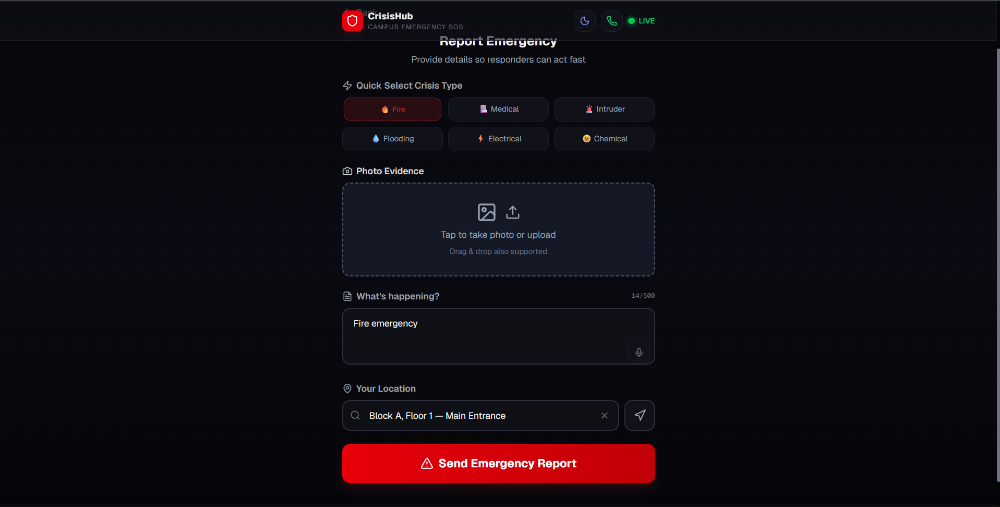
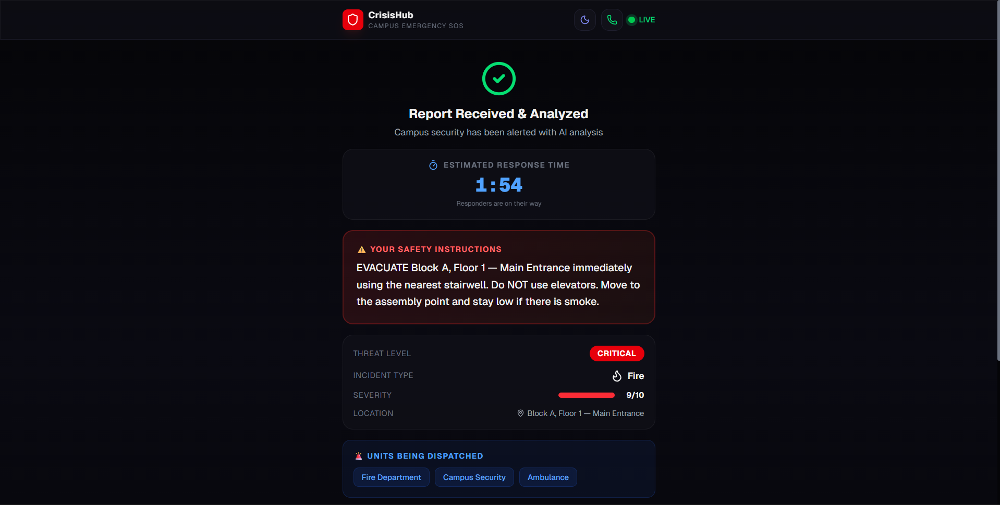
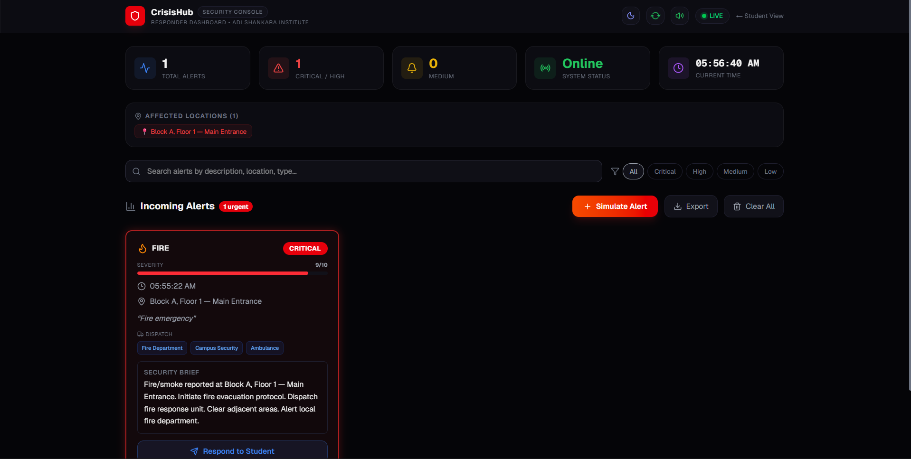
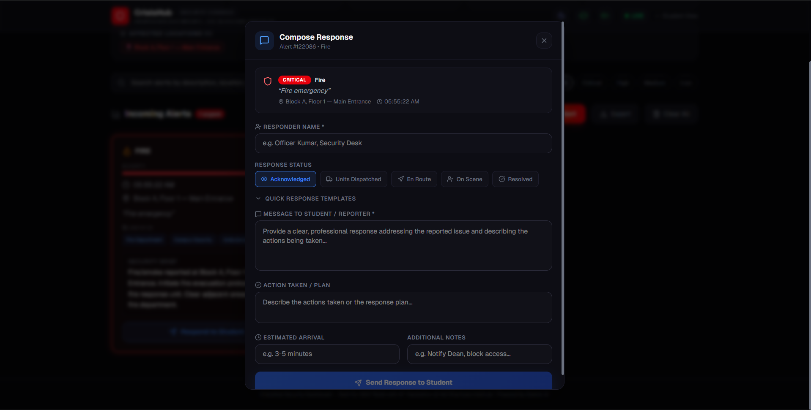

# 🚨 CrisisHub — Campus Emergency SOS

CrisisHub is a **Campus Rapid Crisis & SOS Coordination Hub** designed for fast emergency reporting and response in educational institutions.

Built for a **"Build with AI" hackathon**, this project is tailored for **Adi Shankara Institute** and leverages **Google Gemini AI** to act as an intelligent emergency dispatcher.

---

## 🧠 Overview

During emergencies, students often panic and fail to communicate clearly.  
**CrisisHub solves this problem** by:

- Accepting raw input (text, voice, images)
- Using AI to classify the situation instantly
- Providing **immediate safety instructions**
- Generating a **tactical brief for responders**

---

## ⚙️ Tech Stack

- **Framework:** Next.js 16 (App Router)
- **Styling:** Tailwind CSS v4 + Custom CSS (Glassmorphism, Dark Mode)
- **AI Integration:** Gemini 1.5 Flash (`@google/genai`)
- **Icons:** Lucide React
- **Deployment:** Vercel-ready

---

## 🔄 High-Level Workflow

CrisisHub has two main interfaces:

### 📱 1. Student View (`/`)
Mobile-first design for high-stress situations.

#### 🔴 SOS Ready State
- Large animated **SOS button**
- Clean, distraction-free UI

#### 📝 Data Collection
- Quick crisis buttons (🔥 Fire, 🏥 Medical, 🚨 Intruder)
- 🎤 Voice input
- 📷 Image upload
- 📍 Location selector (campus-based)

#### 🤖 AI Analysis
- Data sent to `/api/crisis-eval`
- Gemini processes:
  - Description
  - Location
  - Image (if available)

- Returns structured output:
  - Threat level (Low → Critical)
  - Incident type
  - Severity score
  - Required responders

#### 🛑 Fallback Mechanism
- If AI fails → local keyword-based logic handles classification

#### ✅ Result Screen
- Displays:
  - Help ETA
  - AI-generated safety steps
- Option to share emergency report

---

### 🖥️ 2. Responder Dashboard (`/dashboard`)
Desktop-first command center for security teams.

#### 📡 Live Monitoring
- Real-time alert polling
- Visual + sound alerts for new incidents

#### 📊 Metrics
- Total active alerts
- Critical/High alerts
- Affected locations summary

#### 🔍 Alert Management
- Filter by severity
- Search by keywords

#### 🧾 AI Tactical Brief
Each alert includes:
- Clear situation summary
- Suggested actions
- Required response units

#### 🚓 Response System
- Responders can:
  - Accept alert
  - Add ETA
  - Send message to student

- Alerts marked as **Responded** with timestamp

---

## 🔗 Communication System

- Uses `localStorage` for simulated real-time updates
- Lightweight solution (no heavy database)
- Ideal for hackathon/demo environments

---

## 🎯 Key Features

- ⚡ Instant AI-powered crisis classification  
- 🧠 Multimodal input (Text, Voice, Image)  
- 🛟 Real-time safety instructions  
- 📡 Live responder dashboard  
- 🔄 AI fallback system  
- 📍 Campus-specific location mapping  

---

## 🖼️ Screenshots

### 💻 IDE Preview


### 📱 Student Interface




### 🖥️ Dashboard



---

## 🚀 Getting Started

```bash
git clone https://github.com/Athul64/CrisisHub.git
cd CrisisHub
npm install
npm run dev
